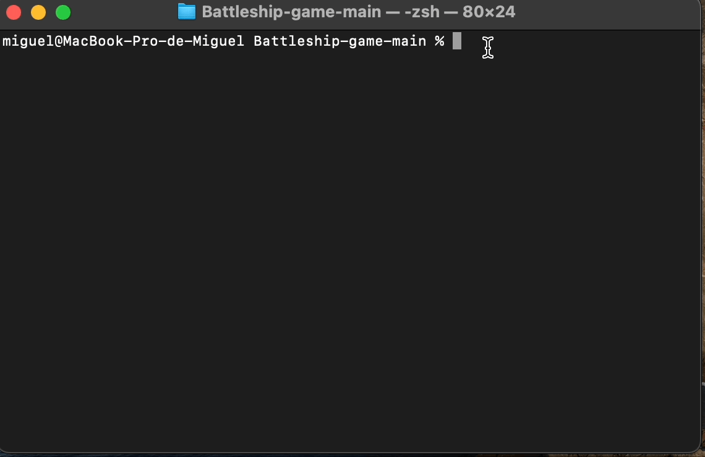

## Battleship-game

# First step : Haskell toolchain installation
Follow recommended installation instructions:  
    https://www.haskell.org/downloads/
    
or just run in a terminal

    curl --proto '=https' --tlsv1.2 -sSf https://get-ghcup.haskell.org | sh    

# Run cabal to start playing
Open a new terminal and go to the BattleShip folder, where the Haskell.cabal file should be. Run the following command to start:
    
    cabal run

# Game rules
First, set the dimensions of the board (nxn). There is a minumum (5) and a maximum (25) size because coordinates go from A to a maximum of Z.

User chooses the size of the ships and the system will place them automatically and randomly. The size of each ship is limited by the board. The system is set to make 1000 attempts to place a ship so, do not try to full the board.
 
Once all the ships has been placed, the system will ask for coordinates. There is an extra number of bullets, which depends on the holes filled with water so take that into account. If you choose wisely, you will sink everything. Let's try it! 

